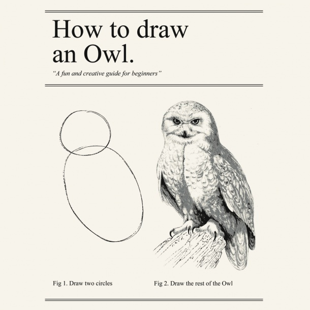

## Overview

1. What is R?

2. Basic Commands

3. Cleaning

4. Plotting

5. Reproducible Research 

--- 

## What is R


Available at http://cran.r-project.org

* A statistical language
* A programming language
* Object-oriented
  * everything is an object in R

--- 

## Why use R?

* It's free!
* It's open source
  * You can see, re-use, and modify code as needed
* It's flexible
* Access to > 5000 packages
* Can easily create data products

--- 

## Why use R?

* Look like a wizard


---

## A major con...

* It's tough!



--- 

## A major con...

* It's tough!


My goal today is to focus on your needs as applied researchers

--- 

## Some useful R packages for reference

* Any type of general linear model: Base
* Logistic Regression: glm
* Structural equation modeling: OpenMx, lavaan
* Multi-level models: lme4, nlme
* Latent Class/Profile Analysis: poLCA, mClust
* Survey Weights: survey
* Propensity Scores: Matching, MatchIt
* Multiple Imputation: mice
* Graphics: ggplot

--- 

## Some helpful R resources for reference

* google!
* [R-bloggers](http://www.r-bloggers.com/)
* [Stack Overflow](http://stackoverflow.com/)
* [Quick-R](http://www.statmethods.net/)
* [An R tutorial](http://www.cyclismo.org/tutorial/R/)
* [A ggplot2 tutorial](http://www.ling.upenn.edu/~joseff/avml2012/)

--- 

## R Examples: Shiny

[Dialect Maps](http://spark.rstudio.com/jkatz/SurveyMaps/)

[babynameR](http://dpmartin42.shinyapps.io/babynameR/)

--- 

## R Examples: googleVis

```{r, echo = FALSE, results = 'asis', message = FALSE}

require(googleVis)

M1 <- gvisMotionChart(Fruits, idvar="Fruit", timevar="Date", options = list(width = 550, height = 350))
print(M1, tag = 'chart')

```

---

## R Examples: googleVis

```{r, echo = FALSE, results = 'asis', message = FALSE}

require(datasets)

states <- data.frame(state.name, state.x77)
M2 <- gvisGeoChart(states, "state.name", "Illiteracy",
                          options=list(region="US", 
                                       displayMode="regions", 
                                       resolution="provinces",
                                       width=550, height=350))

print(M2, tag = 'chart')

```

---

## OK! Before we get started...

1. Download the latest version of R for your operating system
2. Install R Studio
3. Download the materials from https://github.com/dpmartin42/R-Workshop


